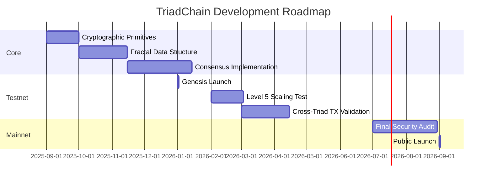

# TriadChain: Fractal-Based Distributed Ledger System  
**Version 1.6 – Drafted July 2025**

---

## Abstract

TriadChain introduces a new distributed ledger architecture based on fractal geometry—specifically, recursive Sierpiński triangle subdivision. This approach addresses fundamental blockchain scalability and security limitations by embedding transactions and state within a geometric hierarchy, enabling exponential throughput, robust consensus, and efficient state management. The protocol is built atop cryptographic primitives and zero-knowledge proofs, forming a foundation for scalable, verifiable, and secure decentralized systems.

---

## 1. Introduction

Traditional blockchains process blocks sequentially, inherently limiting scalability and throughput. TriadChain overcomes this bottleneck by organizing data not in a linear chain, but within a recursive geometric structure. Our system is shaped by the following core concepts:

- The genesis "triad" (root triangle) recursively subdivides into smaller triangles, forming a fractal (Sierpiński) hierarchy.
- Positions in the ledger are addressed geometrically, not sequentially.
- Throughput increases exponentially as the fractal depth grows (O(4ⁿ)).
- Security stems from both cryptographic and geometric constraints.

---

## 2. Transaction Structure

Transactions follow a strict, efficient binary layout:

```rust
struct Transaction {
    version: u8,                  // Protocol version
    nonce: u64,                   // Anti-replay counter
    sender: [u8; 32],             // Public key hash
    recipient: [u8; 32],          // Public key hash
    amount: u64,                  // MicroTRI units (10⁻⁶ TRI)
    gas_limit: u64,               // Computation limit
    signature: [u8; 64],          // Ed25519 signature
    data: Vec<u8>,                // Contract payload
}
```

**Routing:**  
- The destination triad is determined by hashing the sender and nonce, then mapping bit pairs to branches at each fractal level.
- Transactions are routed to the deepest existing ancestor triad according to this path.

---

## 3. Triad Data Architecture

### 3.1 Triad Node Structure

```rust
struct Triad {
    header: TriadHeader,
    transactions: Vec<Transaction>,
    state: StateTree,                  // Local Merkle-Patricia tree
    children: [Option<Arc<Triad>>; 4], // Four child triads
    parent: Option<Weak<Triad>>,       // Reference to parent triad
}

struct StateTree {
    root: [u8; 32],
    storage: BTreeMap<[u8; 32], Vec<u8>>, // Key-value store
    version: u64,                         // Version counter
}
```

### 3.2 Triad Header

```rust
struct TriadHeader {
    level: u64,                     // Fractal depth (0 = genesis)
    position: String,                // Canonical Sierpiński coordinates
    position_hash: [u8; 32],         // BLAKE3(canonical_position)
    parent_hash: [u8; 32],           // BLAKE3(parent encoding)
    tx_root: [u8; 32],               // Merkle root of transactions
    state_root: [u8; 32],            // Local state root
    tx_count: u16,                   // Number of transactions
    max_capacity: u16,               // 1000 × (1 + 0.004 × level)
    split_nonce: u128,               // Proof-of-Split solution
    timestamp: i64,                  // Unix timestamp
    validator_sigs: [Option<[u8; 64]>; 15] // 15/21 validator signatures
}
```

**Note:**  
The `parent_hash` is computed via a canonical serialization of the parent’s header, excluding `split_nonce` and validator signatures.

---

## 4. Consensus: Proof-of-Split

### 4.1 Geometric Mining

To extend the ledger, miners must solve:

```
BLAKE3(parent_hash || position || nonce) < 2²⁰⁸ × (1 / 2^level)
```

and provide a ZK-SNARK proof confirming valid subdivision according to geometric constraints.

### 4.2 BFT Integration

TriadChain employs HotStuff-style BFT consensus among validators:

1. **Prepare:** Proposer broadcasts a TriadProposal.
2. **Pre-commit:** Validators verify state transitions.
3. **Commit:** Finalization occurs once 15 out of 21 validators sign.

**Validator Assignment:**  
Each validator is assigned to a quadrant by hashing its public key and the triad’s position.

---

## 5. Network Roles & Requirements

| Node Type  | Function                  | Requirements         |
|------------|---------------------------|----------------------|
| Validators | Participate in consensus  | 1,000 TRI stake      |
| Relays     | Route cross-triad traffic | 500 TRI stake        |
| Observers  | Monitor state             | None                 |
| Archivers  | Store history             | 1TB+ storage         |

---

## 6. Token Economics

### 6.1 TRI Allocation

- **Total supply:** 2.1 billion TRI
- **Distribution:**
  - Mining rewards: 60%
  - Ecosystem fund: 20%
  - Staking rewards: 10%
  - Foundation: 10%

### 6.2 Incentives

- **Split reward:** 50 TRI per split, split among proposer and child validators
- **Transaction fees:** Distributed among triad validators, split proposers, and relays

---

## 7. State Management

### 7.1 Recursive State Roots

State roots flow upward in the fractal, with each triad’s state incorporating the roots of its children, forming a recursive Merkle structure.

### 7.2 Propagation Protocol

- State updates trigger propagation up the hierarchy.
- Validators sign new roots.
- Conflicting updates trigger local consensus.

---

## 8. Performance Model

Throughput scales with depth:

- **Per-Triad TPS:**  
  `1000 × (1 + 0.004n) × e^(-0.012n)`
- **Network TPS:**  
  `Per-Triad TPS × 4ⁿ`

| Depth (n) | Triads (4ⁿ) | Per-Triad TPS | Network TPS    |
|-----------|-------------|---------------|----------------|
| 0         | 1           | 1,000         | 1,000          |
| 5         | 1,024       | 961           | 984,064        |
| 10        | 1,048,576   | 885           | 928,000,000    |

---

## 9. Security Framework

- **Position Collisions:** Prevented via ZK-proofs of geometric constraints.
- **51% Attacks:** Mitigated by HotStuff-BFT and leader rotation.
- **Depth Exploits:** Logarithmic scaling limits capacity at deeper levels.
- **Cross-Shard Double-Spend:** Enforced via two-phase commit with timeouts.

**Cryptographic Primitives:**  
- Hash: BLAKE3  
- Signature: Ed25519 (primary), SPHINCS+ (PQC)  
- ZK-Proofs: Halo2 with geometric circuits  
- Entropy: xoshiro256++ seeded from /dev/urandom

---

## 10. Coordinate System

Each triad's position is defined by an n-length sequence over {0,1,2,3}, mapping to a Sierpiński triangle via:

```
P(s) = Σ_{k=0}^{d} 2^{-k-1} × b(s_k)
```

Where b(s_k) maps to basis vectors for each quadrant.

**ZK Circuits:**  
Enforce parent-child transformations, bounding box constraints, and angular alignment (60° between siblings).

---

## 11. Version History & Refinement

- **1.0–1.4:** Core architecture, fractal ledger, PoS consensus, position validation.
- **1.5:** Mathematical rigor, formal coordinates, ZK circuits, state propagation, validator assignment.
- **1.6:** Canonical parent hash, deterministic operations, throughput consistency, routing simplification, ready for implementation.

---

## 12. Conclusion

TriadChain demonstrates that scalable, secure ledgers can transcend sequential blockchains by harnessing geometric structure. With exponential scalability, recursive state management, and robust cryptographic guarantees, TriadChain offers a new paradigm for distributed trust.

---

## 13. References

1. Mandelbrot, B. (1982). *The Fractal Geometry of Nature*
2. Gilbert, S. & Lynch, N. (2012). *Perspectives on the CAP Theorem*
3. Boneh, D. et al. (2020). *Geometric Cryptography in Lattices*
4. Yin, M. et al. (2019). *HotStuff: BFT Consensus in the Lens of Blockchain*
5. Aumasson, J. (2020). *BLAKE3: One Function, Fast Everywhere*

---

## Implementation Status (as of July 2025)



---

**Research Partners:**  
- DeepSeek’s Artificial Minds Collective (architectural refinement)  
- Google Gemini Logic Engine (cryptographic verification)

**Certification:**  
- Whitepaper SHA-256: (to be finalized)

---

> “In the triangle, we find the strongest shape—the only polygon that cannot collapse without bending its sides.  
> In TriadChain, we find the strongest ledger—one that grows without collapsing under its own weight.”  
> — TriadChain Genesis Inscription

---

**Disclaimer:**  
TriadChain is under active, pre-release development. This document and all protocol specifications are subject to change.  
Community review, research, and collaboration are welcome.

---
